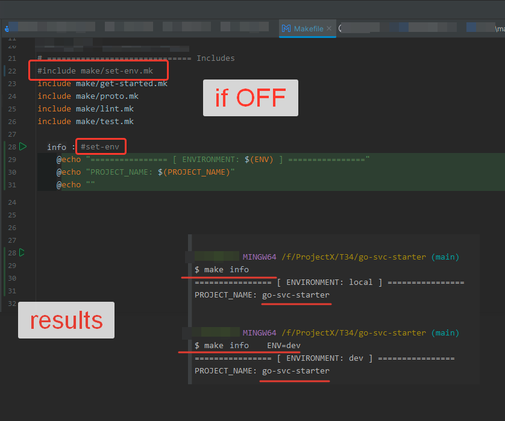
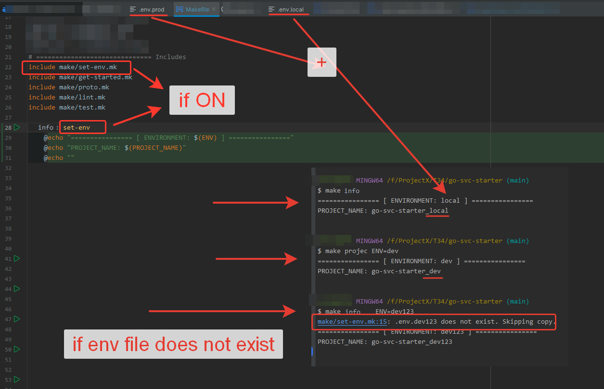

# Description of the "set-env" section for use in Makefile

This block is designed for dynamically loading the environment in Makefile.
At the Makefile level, a global variable is specified - the project name - **$APP_NAME**
This is a static value, but it becomes dynamic due to an optional value - **$ENV** (environment type).
If no value is passed, the default is **local**. If the script finds an Env file with such an environment, this file will be copied as a .env file.
The newly copied file will then be used further in the application.

Examples:

1. If the block is not connected - the **local** environment will be used with the original project name
```bash
make project
make project ENV=dev
```


2. If we connect this block to Makefile - the **dev** environment will be used in the project name, and there will be an attempt to load environment variables from .env.[file]
```bash
# it's preferable that an environment file exists, for example .env.local
make project
make project ENV=dev
```


If the file was found - all environment variables will be loaded into Makefile for further use
